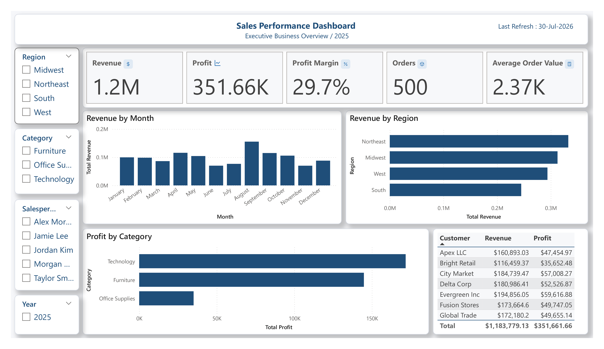

# 📈 Sales Performance Dashboard

## 📌 Project Overview

This interactive Power BI dashboard provides a comprehensive overview of sales performance across products, customers, regions, and time. It enables business users to monitor KPIs, identify trends, and make data-driven decisions.

---

## 🎯 Business Objectives

- Monitor overall sales performance
- Track profitability
- Compare regional performance
- Identify top-performing customers
- Analyze monthly sales trends

---

## 📊 Key Performance Indicators (KPIs)

- 💰 Total Revenue
- 📈 Total Profit
- 📊 Profit Margin
- 🛒 Total Orders
- 💵 Average Order Value

---

## 🛠 Tools & Technologies

- Microsoft Power BI
- Power Query
- DAX
- Data Modeling
- Microsoft Excel

---

## 📷 Dashboard Preview

---

## 🧮 DAX Measures

- Total Revenue
- Total Profit
- Profit Margin
- Total Orders
- Average Order Value

---

## 💡 Business Insights

- Track monthly revenue trends
- Compare sales by region
- Identify top customers
- Analyze profit by category
- Monitor overall business performance

---

## 🚀 Skills Demonstrated

- Data Cleaning
- Data Modeling
- DAX
- KPI Design
- Interactive Dashboard Design
- Business Intelligence
