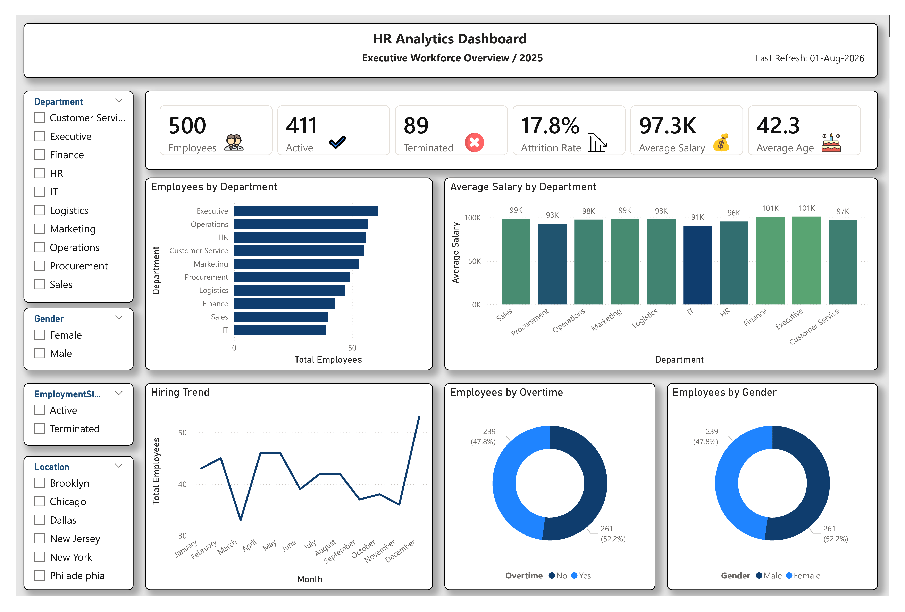

# 👥 HR Analytics Dashboard

## 📌 Project Overview
This HR Analytics Dashboard was built in Microsoft Power BI to analyze workforce performance, employee distribution, salary trends, and attrition. The dashboard provides HR managers with key insights for making data-driven decisions.

---

## 📊 Dashboard Preview

> Add your dashboard screenshot here as Dashboard.png

---

## 📁 Files Included

- HR_Analytics_Dashboard.pbix
- HR_Analytics_Dataset.xlsx
- Dashboard.png

---

## 📈 Key KPIs

- Total Employees
- Active Employees
- Terminated Employees
- Attrition Rate
- Average Salary
- Average Age

---

## 📊 Visualizations

- Employees by Department
- Average Salary by Department
- Hiring Trend
- Employees by Gender
- Employees by Overtime
- Interactive Filters (Department, Gender, Employment Status, Location)

---

## 🛠 Tools Used

- Microsoft Power BI
- Power Query
- DAX
- Microsoft Excel

---

## 💡 Business Insights

- Identified departments with the highest employee count.
- Compared average salary across departments.
- Measured employee attrition rate.
- Analyzed hiring trends throughout the year.
- Evaluated workforce distribution by gender and overtime.

---

## 📷 Dashboard

---

## 👤 Author

Alisher Shakarov

Power BI Developer

GitHub:
https://github.com/Alisher-PowerBI

GitHub (https://github.com/Alisher-PowerBI)
Alisher-PowerBI - Overview
Alisher-PowerBI has one repository available. Follow their code on GitHub.