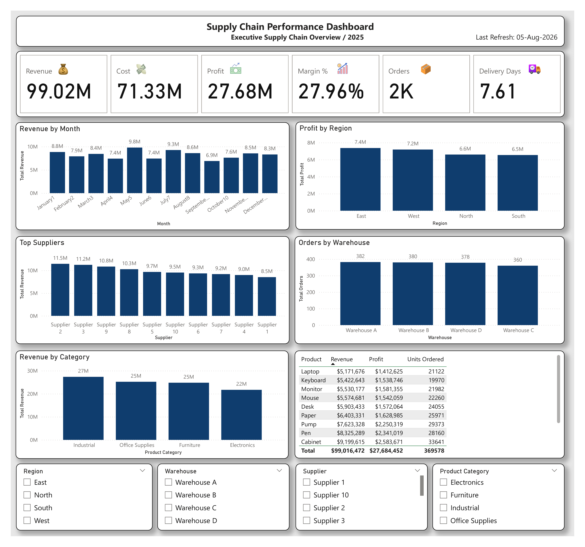

\# 🚚 Supply Chain Performance Dashboard

\## 📊 Project Overview

This Power BI dashboard provides a comprehensive analysis of supply chain performance for a fictional company. It helps business leaders monitor revenue, costs, profitability, warehouse performance, supplier performance, and delivery efficiency through interactive visualizations.

\---

\## 📌 Dashboard Preview

\---

\## 📈 Key KPIs

- 💰 Total Revenue
- 💸 Total Cost
- 💵 Total Profit
- 📈 Profit Margin %
- 📦 Total Orders
- 🚚 Average Delivery Days

\---

\## 📊 Dashboard Features

\### Revenue Analysis

- Revenue by Month
- Revenue by Product Category

\### Profit Analysis

- Profit by Region

\### Supplier Performance

- Top Suppliers by Revenue

\### Warehouse Analysis

- Orders by Warehouse

\### Product Analysis

- Revenue, Profit, and Units Ordered by Product

\### Interactive Filters

- Region
- Warehouse
- Supplier
- Product Category

\---

\## 🛠️ Tools Used

- Microsoft Power BI
- Power Query
- DAX
- Microsoft Excel

\---

\## 📂 Files Included

- 📄 SupplyChain\_Performance\_Dashboard.pbix
- 📊 SupplyChain\_Performance\_Dataset.xlsx
- 🖼️ Dashboard.png
- 📘 README.md

\---

\## 🎯 Business Insights

- Identify top-performing suppliers.
- Monitor warehouse order volume.
- Compare regional profitability.
- Analyze monthly revenue trends.
- Track product category performance.
- Measure supply chain efficiency using delivery days.

\---

\## 👨‍💻 Author

Alisher Shakarov

Power BI Portfolio

GitHub:

https://github.com/Alisher-PowerBI

LinkedIn:

(Your LinkedIn Profile)

\---

⭐️ Thank you for visiting my Power BI Portfolio!

GitHub (https://github.com/Alisher-PowerBI)

Alisher-PowerBI - Overview

Alisher-PowerBI has one repository available. Follow their code on GitHub.
