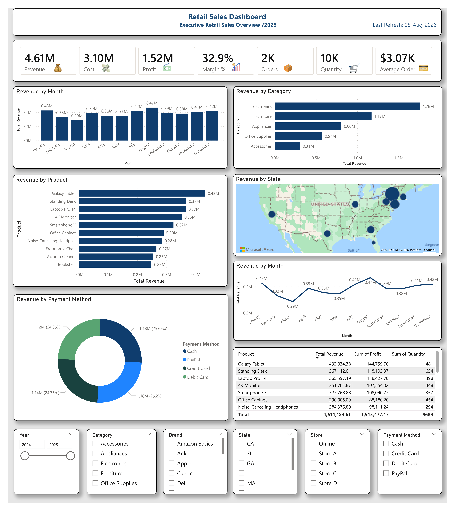

# 🛍️ Retail Sales Dashboard

## 📊 Project Overview

This Power BI dashboard provides a comprehensive analysis of retail sales performance for a fictional retail company. It helps business leaders monitor sales, profitability, product performance, customer purchasing trends, and regional sales through interactive visualizations.

---

## 📌 Dashboard Preview

---

## 📈 Key Performance Indicators (KPIs)

- 💰 Total Revenue

- 💸 Total Cost

- 📈 Total Profit

- 📊 Profit Margin %

- 🛒 Total Orders

- 📦 Total Quantity Sold

- 💳 Average Order Value

---

## 📊 Dashboard Features

### Sales Analysis

- Revenue by Month

- Revenue Trend

- Revenue by Category

- Top Products by Revenue

### Geographic Analysis

- Revenue by State (Map)

### Payment Analysis

- Revenue by Payment Method

### Product Performance

- Product Revenue

- Product Profit

- Quantity Sold

---

## 🎛 Interactive Filters

- Year

- Category

- Brand

- State

- Store

- Payment Method

---

## 🛠 Tools Used

- Microsoft Power BI

- Power Query

- DAX

- Data Modeling

- Interactive Visualizations

---

## 📁 Files Included

- 📊 Retail Sales Dashboard.pbix

- 📄 Retail_Sales_Dataset.xlsx

- 🖼 Dashboard.png

- 📘 README.md

---

## 💡 Business Insights

- Identify top-performing products.

- Compare sales across product categories.

- Analyze monthly sales trends.

- Evaluate regional sales performance.

- Monitor profit margin.

- Track customer purchasing behavior.

- Analyze payment method distribution.

---

## 👨‍💻 Author

Alisher Shakarov

Power BI Portfolio Project

GitHub:

https://github.com/Alisher-PowerBI

LinkedIn:

(Add your LinkedIn profile here)

---

⭐️ If you like this project, please consider giving it a Star!

GitHub (https://github.com/Alisher-PowerBI)
Alisher-PowerBI - Overview
Alisher-PowerBI has one repository available. Follow their code on GitHub.