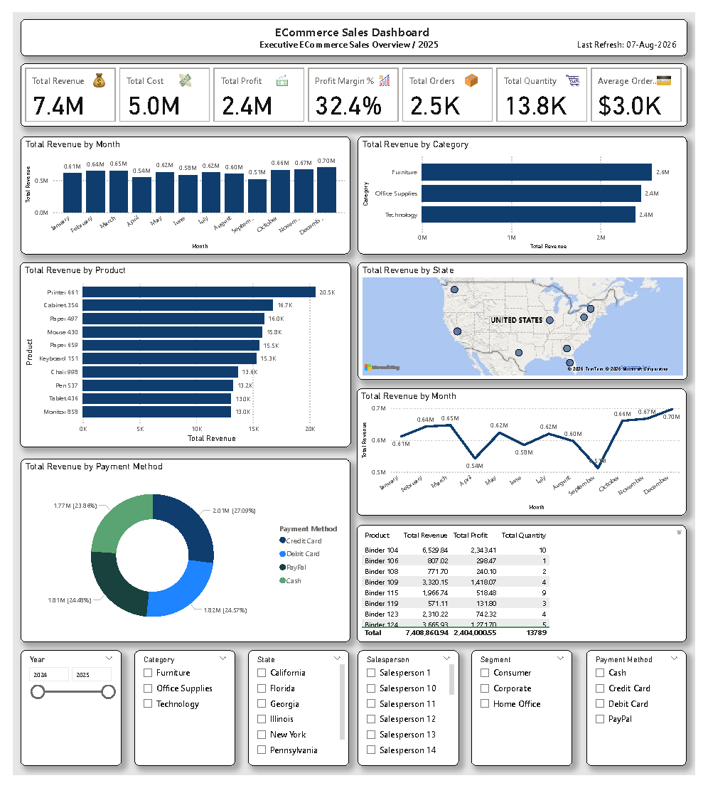

# 🛒 ECommerce Sales Dashboard

## 📊 Project Overview

This Power BI dashboard provides a comprehensive analysis of eCommerce sales performance for a fictional online retail company. It enables business leaders to monitor revenue, profitability, customer purchasing behavior, product performance, and regional sales through interactive visualizations.

---

## 📌 Dashboard Preview

> Replace the image below with your dashboard screenshot after uploading.

---

## 📈 Key KPIs

- 💰 Total Revenue
- 💸 Total Cost
- 📈 Total Profit
- 📊 Profit Margin %
- 📦 Total Orders
- 🛒 Total Quantity Sold
- 💳 Average Order Value

---

## 📊 Dashboard Features

### Revenue Analysis
- Monthly Revenue Trend
- Revenue by Category
- Top Products by Revenue

### Geographic Analysis
- Revenue by State (Map)

### Customer & Sales Analysis
- Revenue by Payment Method
- Revenue Trend by Month
- Product Performance Table

### Interactive Filters
- Year
- Category
- Product
- State
- Segment
- Payment Method

---

## 🛠 Tools Used

- Microsoft Power BI
- Power Query
- DAX Measures
- Data Modeling
- Excel Dataset

---

## 📂 Files Included

- 📄 ECommerce Sales Dashboard.pbix
- 📊 ECommerce_Sales_Dataset_2500_Rows.xlsx
- 🖼 Dashboard.png
- 📘 README.md

---

## 💡 Business Insights

- Identify top-performing product categories.
- Monitor monthly revenue trends.
- Analyze profitability across products.
- Compare sales performance by state.
- Evaluate customer payment preferences.
- Track overall sales performance using KPI cards.

---

## 🚀 Skills Demonstrated

- Power BI Dashboard Design
- DAX Calculations
- Data Modeling
- KPI Development
- Interactive Slicers
- Data Visualization
- Business Intelligence Reporting

---

## 👨‍💻 Author

Alisher Shakarov

Power BI Portfolio Project

GitHub:
https://github.com/Alisher-PowerBI

GitHub (https://github.com/Alisher-PowerBI)
Alisher-PowerBI - Overview
Alisher-PowerBI has one repository available. Follow their code on GitHub.