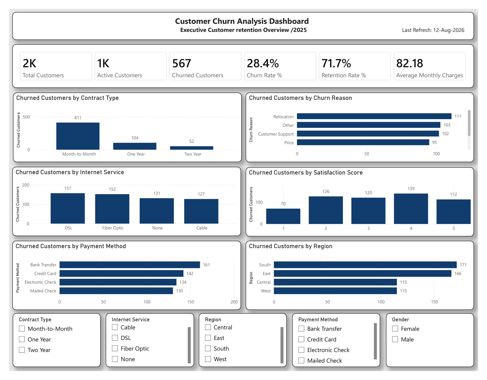

# 📉 Customer Churn Analysis Dashboard

## 📊 Project Overview

This Power BI project provides an interactive analysis of customer churn and retention for a fictional telecommunications company.

The dashboard helps identify customer churn patterns across contract types, internet services, payment methods, regions, satisfaction scores, and churn reasons. The goal is to help business stakeholders understand the main drivers of customer attrition and support data-driven retention strategies.

---

## 📌 Dashboard Preview



---

## 🎯 Project Objectives

- Analyze overall customer churn and retention
- Identify the main reasons customers leave
- Compare churn across different contract types
- Analyze churn by internet service
- Evaluate customer satisfaction and churn behavior
- Compare churn across payment methods
- Identify regional churn patterns
- Provide interactive filtering for deeper analysis

---

## 📊 Key Performance Indicators (KPIs)

| KPI | Value |
|---|---:|
| Total Customers | 2,000 |
| Active Customers | 1,433 |
| Churned Customers | 567 |
| Churn Rate | 28.4% |
| Retention Rate | 71.7% |
| Average Monthly Charges | $82.18 |

---

## 📈 Dashboard Visualizations

### 1. Churned Customers by Contract Type
Analyzes customer churn across Month-to-Month, One Year, and Two Year contracts.

### 2. Churned Customers by Churn Reason
Highlights the major reasons associated with customer churn, including relocation, customer support, price, and other factors.

### 3. Churned Customers by Internet Service
Compares churn across DSL, Fiber Optic, Cable, and customers with no internet service.

### 4. Churned Customers by Satisfaction Score
Shows how churned customers are distributed across satisfaction scores from 1 to 5.

### 5. Churned Customers by Payment Method
Analyzes churn across Bank Transfer, Credit Card, Electronic Check, and Mailed Check.

### 6. Churned Customers by Region
Compares customer churn across South, East, Central, and West regions.

---

## 🔍 Interactive Filters

The dashboard includes slicers for:

- Contract Type
- Internet Service
- Region
- Payment Method
- Gender

These filters allow users to interactively explore churn patterns across different customer segments.

---

## 💡 Key Insights

- The overall customer churn rate is approximately 28.4%.
- 567 out of 2,000 customers have churned.
- The overall retention rate is approximately 71.7%.
- Month-to-Month contracts have the highest number of churned customers.
- Bank Transfer has the highest churn count among the payment methods shown.
- The South region has the highest number of churned customers among the regions analyzed.
- Churn behavior varies across internet service types and satisfaction scores.

---

## 🧮 DAX Measures

Key DAX measures created for the dashboard include:

```DAX
Total Customers =
DISTINCTCOUNT(CustomerChurnTable[Customer ID])

Churned Customers =
CALCULATE(
    [Total Customers],
    CustomerChurnTable[Churn] = "Yes"
)

Active Customers =
[Total Customers] - [Churned Customers]

Churn Rate % =
DIVIDE(
    [Churned Customers],
    [Total Customers],
    0
)

Retention Rate % =
DIVIDE(
    [Active Customers],
    [Total Customers],
    0
)

Average Monthly Charges =
AVERAGE(CustomerChurnTable[Monthly Charges])

🛠️ Tools & Technologies
Microsoft Power BI Desktop
Power Query
DAX
Microsoft Excel
Data Modeling
Data Visualization
GitHub


⸻


📁 Project Files
Customer_Churn_Analysis_Dashboard.pbix — Power BI dashboard
Customer_Churn_Dataset.xlsx — Source dataset
Dashboard.png — Dashboard preview
README.md — Project documentation


⸻


📚 Skills Demonstrated
Data Cleaning & Transformation
Data Modeling
DAX Measure Development
KPI Development
Customer Churn Analysis
Customer Retention Analysis
Interactive Dashboard Design
Business Intelligence
Data Visualization
Business Insight Generation


⸻


👤 Author
Alisher Shakarov
Power BI | Data Analytics | Business Intelligence


⸻


⭐️ If you found this project useful, feel free to star the repository.