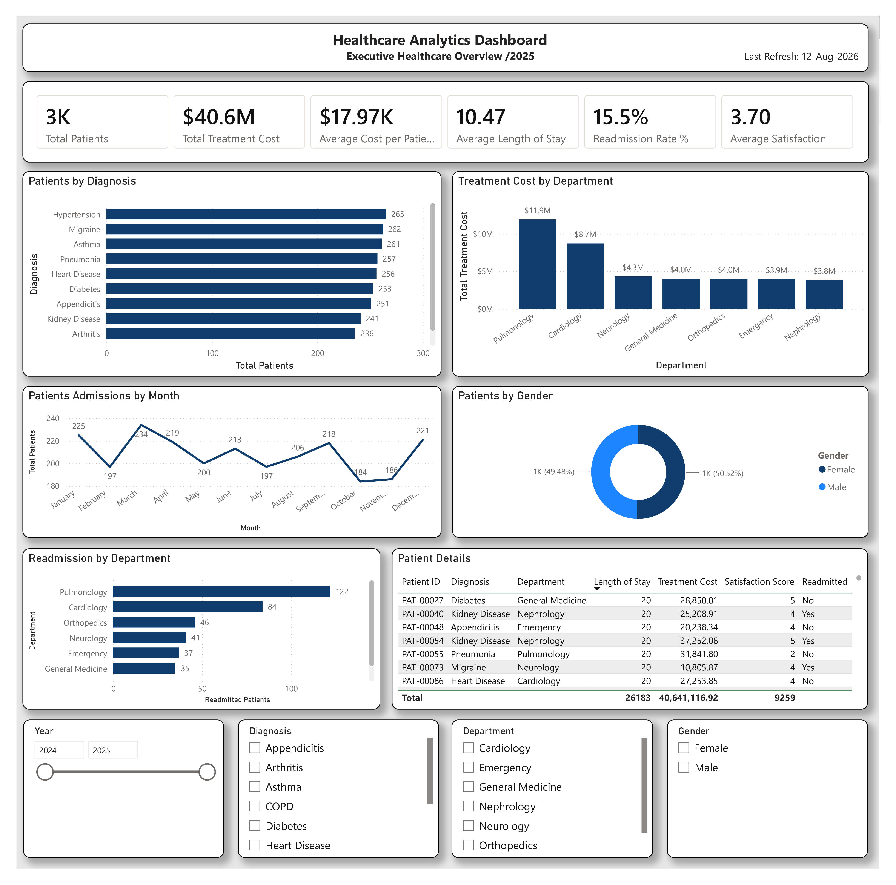

# 🏥 Healthcare Analytics Dashboard

## 📊 Project Overview

This Power BI project provides an interactive analysis of healthcare operations and patient outcomes for a fictional healthcare organization.

The dashboard helps analyze patient volume, treatment costs, length of stay, readmission rates, satisfaction scores, diagnoses, and departmental performance. The goal is to provide healthcare stakeholders with clear insights that support data-driven decision-making and operational improvement.

---

## 📌 Dashboard Preview



---

## 🎯 Key Performance Indicators (KPIs)

The dashboard includes the following key metrics:

- 👥 Total Patients: 2.5K
- 💰 Total Treatment Cost: $40.6M
- 💵 Average Cost per Patient: $17.97K
- 🏥 Average Length of Stay: 10.47 days
- 🔄 Readmission Rate: 15.5%
- ⭐ Average Satisfaction Score: 3.70

---

## 📈 Dashboard Visualizations

### 1. Patients by Diagnosis
Analyzes patient volume across different medical diagnoses.

### 2. Treatment Cost by Department
Compares total treatment costs across hospital departments.

### 3. Patient Admissions by Month
Shows monthly patient admission trends and helps identify changes in patient volume over time.

### 4. Patients by Gender
Displays the distribution of patients by gender.

### 5. Readmission by Department
Identifies departments with the highest number of readmitted patients.

### 6. Patient Details
Provides detailed patient-level information including:

- Patient ID
- Diagnosis
- Department
- Length of Stay
- Treatment Cost
- Satisfaction Score
- Readmission Status

---

## 🎛️ Interactive Filters

Users can dynamically analyze the dashboard using:

- Year
- Diagnosis
- Department
- Gender

All dashboard visuals respond interactively to the selected filters.

---

## 🧮 DAX Measures

Key DAX measures created for this project include:

```DAX
Total Patients =
DISTINCTCOUNT(HealthcareTable[Patient ID])

```DAX
 Total Treatment Cost =
SUM(HealthcareTable[Treatment Cost])

```DAX
Average Cost per Patient =
DIVIDE(
    [Total Treatment Cost] + [Total Medication Cost],
    [Total Patients],
    0
)
```DAX
 Average Length of Stay =
AVERAGE(HealthcareTable[Length of Stay])

```DAX Readmitted Patients =
CALCULATE(
    [Total Patients],
    HealthcareTable[Readmitted] = "Yes"
)
```DAX
Readmission Rate % =
DIVIDE(
    [Readmitted Patients],
    [Total Patients],
    0
)
```DAX
 Average Satisfaction =
AVERAGE(HealthcareTable[Satisfaction Score])

 🗂️ Data Model
The Power BI data model includes:
HealthcareTable – Main healthcare dataset
Date Table – Calendar table used for time-based analysis
Measure Table – Dedicated table for DAX measures
A one-to-many relationship connects the Date table to the healthcare dataset through the admission date.


⸻


🛠️ Tools & Technologies
Microsoft Power BI Desktop
Microsoft Excel
Power Query
DAX
Data Modeling
Data Visualization
GitHub


⸻


📂 Project Files
Healthcare_Analytics_Dashboard.pbix – Power BI dashboard
Healthcare_Analytics_Dataset_2500_Rows.xlsx – Source dataset
Dashboard.png – Dashboard screenshot
README.md – Project documentation


⸻


💡 Key Business Insights
The dashboard enables stakeholders to:
Monitor overall patient volume
Track healthcare treatment costs
Analyze average treatment cost per patient
Monitor patient length of stay
Identify departments with higher readmissions
Compare patient volumes across diagnoses
Analyze patient satisfaction
Monitor monthly admission trends
Explore healthcare performance using interactive filters


⸻


🚀 Project Objective
The objective of this project is to demonstrate practical Power BI skills in healthcare analytics, including data preparation, data modeling, DAX calculations, KPI development, interactive dashboard design, and business-focused data visualization.


⸻


👤 Author
Alisher Shakarov
Power BI / Data Analytics Portfolio Project