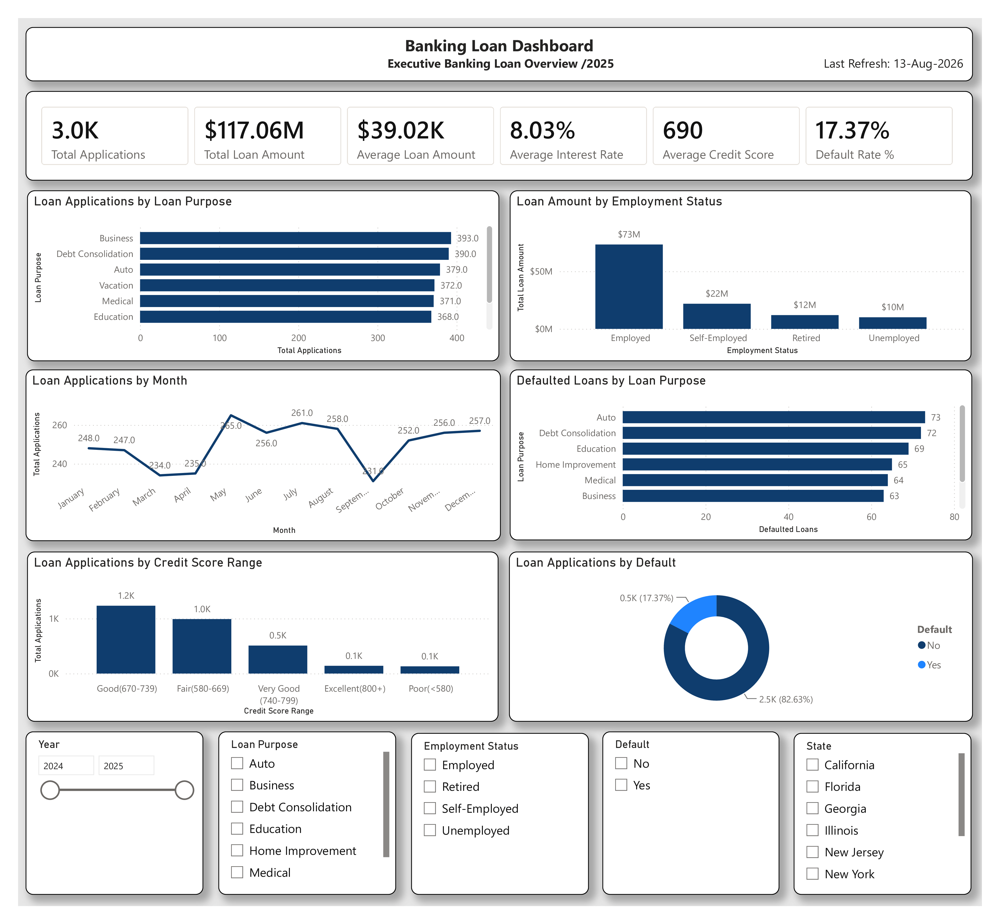

# 🏦 Banking Loan Analysis Dashboard

## 📊 Project Overview

This Power BI project provides an interactive analysis of banking loan applications, loan amounts, credit risk, and borrower characteristics.

The dashboard helps analyze loan application trends, lending volume, default behavior, credit score distribution, employment status, and loan purposes. The goal is to provide banking stakeholders with clear insights that support data-driven lending and risk management decisions.

---

## 📌 Dashboard Preview

---

## 🎯 Key KPIs

- Total Applications: 3.0K
- Total Loan Amount: $117.06M
- Average Loan Amount: $39.02K
- Average Interest Rate: 8.03%
- Average Credit Score: 690
- Default Rate: 17.37%

---

## 📈 Dashboard Analysis

The dashboard includes the following analytical views:

- Loan Applications by Loan Purpose
- Loan Amount by Employment Status
- Loan Applications by Month
- Defaulted Loans by Loan Purpose
- Loan Applications by Credit Score Range
- Loan Applications by Default Status

---

## 🔍 Interactive Filters

Users can dynamically explore the dashboard using:

- Year
- Loan Purpose
- Employment Status
- Default Status
- State

---

## 💡 Key Insights

- The portfolio contains approximately 3,000 loan applications.
- Total lending volume exceeds $117 million.
- The average loan amount is approximately $39K.
- The average borrower credit score is approximately 690.
- The overall default rate is approximately 17.37%.
- Loan applications can be compared across different purposes, employment groups, credit score ranges, and states.
- Default analysis helps identify areas of potential lending risk.

---

## 🛠 Tools & Technologies

- Microsoft Power BI
- Power Query
- DAX
- Microsoft Excel
- Data Modeling
- Data Visualization
- Business Intelligence

---

## 📂 Dataset

The project uses a fictional banking loan dataset containing 3,000 records and 20 columns.

The dataset includes information such as:

- Customer ID
- Application Date
- Age
- Gender
- Marital Status
- Annual Income
- Employment Status
- Credit Score
- Loan Amount
- Loan Purpose
- Loan Term
- Interest Rate
- Monthly Payment
- Debt-to-Income Ratio
- Home Ownership
- Number of Dependents
- Default Status
- Region
- State

---

## 📊 DAX Measures

Key measures created for this project include:

- Total Applications
- Total Loan Amount
- Average Loan Amount
- Average Interest Rate
- Average Credit Score
- Defaulted Loans
- Default Rate %

---

## 🎯 Business Value

This dashboard can help financial institutions:

- Monitor loan application volume
- Analyze lending trends
- Evaluate borrower credit profiles
- Identify default patterns
- Compare loan purposes and employment groups
- Support credit risk analysis
- Improve data-driven lending decisions

---

## 👤 Author

Alisher Shakarov

Power BI | Data Analytics | Business Intelligence

---

⭐️ If you found this project useful, feel free to star the repository.