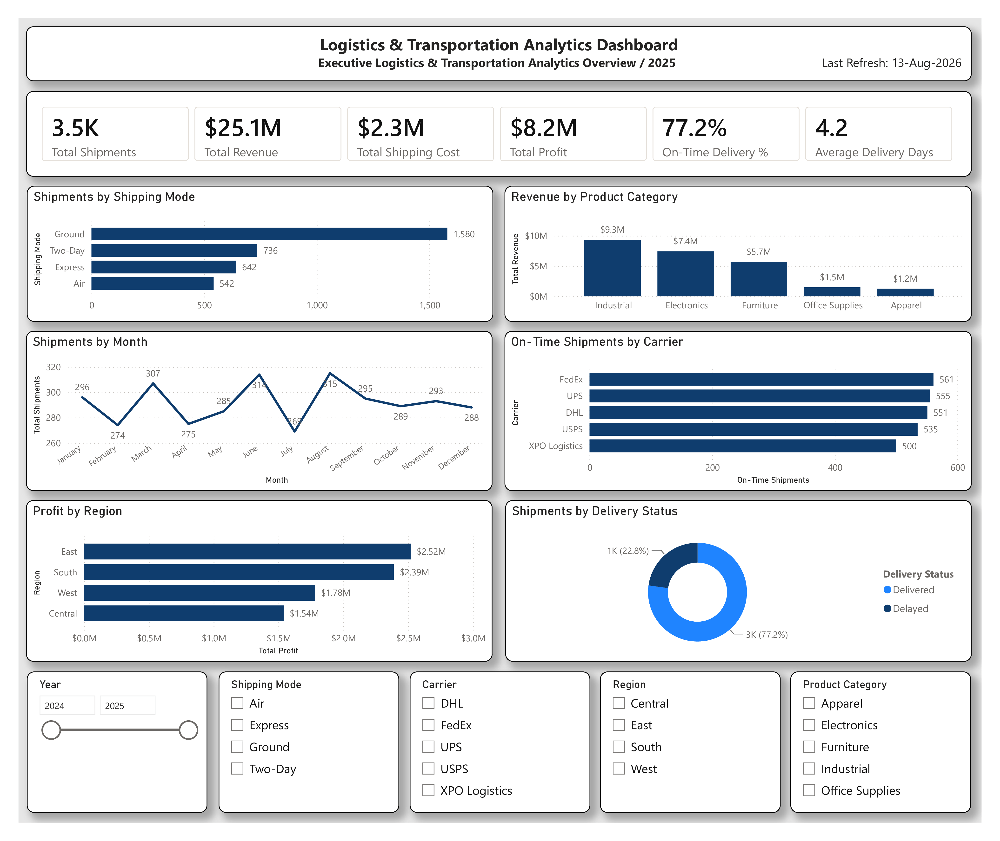

# 🚚 Logistics & Transportation Analytics Dashboard

## 📊 Project Overview

This Power BI project provides an interactive analysis of logistics and transportation performance for a fictional logistics company.

The dashboard helps analyze shipment volume, revenue, shipping costs, profitability, delivery performance, shipping modes, carriers, regions, and product categories. The goal is to provide logistics stakeholders with clear insights that support data-driven operational and transportation decisions.

---

## 📌 Dashboard Preview



---

## 🎯 Key KPIs

- Total Shipments: 3.5K
- Total Revenue: $25.1M
- Total Shipping Cost: $2.3M
- Total Profit: $8.2M
- On-Time Delivery Rate: 77.2%
- Average Delivery Days: 4.2

---

## 📈 Dashboard Analysis

### 🚛 Shipments by Shipping Mode
Analyzes shipment volume across different transportation methods including:
- Ground
- Two-Day
- Express
- Air

Ground shipping represents the largest share of total shipments.

### 📦 Revenue by Product Category
Compares total revenue across product categories:
- Industrial
- Electronics
- Furniture
- Office Supplies
- Apparel

Industrial products generate the highest revenue.

### 📅 Shipments by Month
Shows monthly shipment trends and helps identify fluctuations in shipment volume throughout the year.

### 🚚 On-Time Shipments by Carrier
Evaluates carrier delivery performance across:
- FedEx
- UPS
- DHL
- USPS
- XPO Logistics

This visual helps identify carriers handling the highest number of on-time shipments.

### 🌎 Profit by Region
Compares profitability across:
- East
- South
- West
- Central

The East region generates the highest total profit.

### ⏱️ Shipments by Delivery Status
Shows the distribution between:
- Delivered
- Delayed

Approximately 77.2% of shipments were delivered on time, while 22.8% were delayed.

---

## 🎛️ Interactive Filters

The dashboard includes interactive slicers for:

- Year
- Shipping Mode
- Carrier
- Region
- Product Category

These filters allow users to dynamically explore logistics performance across different business dimensions.

---

## 🧮 Key DAX Measures

```DAX
Total Shipments =
COUNTROWS(LogisticsTable)

Total Revenue =
SUM(LogisticsTable[Revenue])

Total Shipping Cost =
SUM(LogisticsTable[Shipping Cost])

Total Profit =
SUM(LogisticsTable[Profit])

On-Time Delivery % =
DIVIDE(
    CALCULATE(
        COUNTROWS(LogisticsTable),
        LogisticsTable[On Time] = "Yes"
    ),
    [Total Shipments],
    0
)

Average Delivery Days =
AVERAGE(LogisticsTable[Delivery Days])

🗂️ Data Model
The Power BI data model includes:
LogisticsTable – Main logistics transaction dataset
DateTable – Calendar table used for time-based analysis
The DateTable is connected to the logistics dataset through the order date, enabling monthly and yearly analysis.


⸻


🛠️ Tools & Technologies
Microsoft Power BI Desktop
Microsoft Excel
Power Query
DAX
Data Modeling
Data Visualization
Business Intelligence


⸻


💡 Key Business Insights
Ground shipping handles the highest shipment volume.
Industrial products generate the highest revenue.
The East region produces the highest total profit.
Overall on-time delivery performance is approximately 77%.
FedEx has the highest number of on-time shipments in the dataset.
Monthly shipment volumes remain relatively stable with several noticeable peaks and declines.


⸻


📁 Project Files
Logistics_Transportation_Analytics_Dashboard.pbix
Logistics_Analytics_Dataset_3500_Rows.xlsx
Dashboard.png
README.md


⸻


👤 Author
Alisher Shakarov
Power BI | Data Analytics | Business Intelligence


⸻


⭐️ If you found this project useful, feel free to star the repository.
